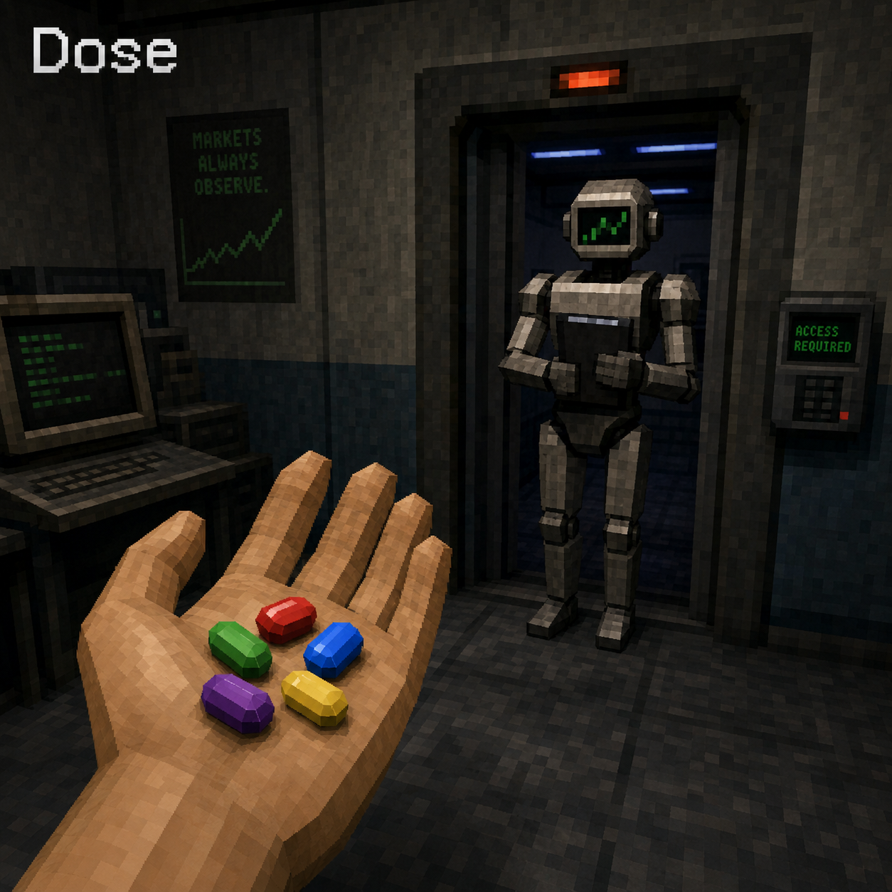

<p align="center">
  <picture>
    <source media="(prefers-color-scheme: dark)" srcset="assets/logo-dark.png">
    
  </picture>
</p>

<h1 align="center">Dose</h1>

<p align="center">
  <em>Pop a pill. Gain a power. Switch anytime.</em>
</p>

<p align="center">
  
  
</p>

---

Five colored pills. Each one changes how your AI agent approaches code.

Pop a red pill for raw performance. Pop blue for clean architecture. Green for
bulletproof security. Yellow to ship fast with less code. Purple for everything
at once.

Switch between them anytime. The effect is instant.

## The pills

| | Pill | Color | Focus | Your agent becomes... |
|---|------|-------|-------|----------------------|
| 🔴 | **Titan** | Red | Performance | An optimizer. Caches hot paths, parallelizes work, profiles before acting. |
| 🔵 | **Sage** | Blue | Architecture | A designer. Patterns, clean code, maintainability, domain-driven thinking. |
| 🟢 | **Warden** | Green | Security | A guardian. Validates every input, handles every error, never silent-fails. |
| 🟡 | **Phantom** | Yellow | Minimal | A shipper. Deletes before adding. One line over fifty. **Default pill.** |
| 🟣 | **Void** | Purple | Full spectrum | A strategist. Chooses the right pill for each part of the task automatically. |

## How it works

Each pill defines its own **ladder** — the sequence of rungs your agent stops
at before writing code:

```text
1. Does this need to exist? (YAGNI)
2. Does the standard library do it?
3. Does a native platform feature cover it?
4. (Pill-specific rung — varies by color)
5. Write the minimum code that works for this pill.
```

### Titan ladder (red)

```
1. YAGNI           2. Stdlib          3. Native
4. One line that performs? One line.
5. Optimize: cache → SIMD → parallel → data-oriented
6. Minimum performing code.
```

### Sage ladder (blue)

```
1. YAGNI           2. Stdlib          3. Native
4. Well-known pattern fits? Apply it.
5. One clean abstraction? One abstraction.
6. Minimum maintainable code.
```

### Warden ladder (green)

```
1. YAGNI           2. Stdlib          3. Native
4. Validate every input at trust boundaries.
5. Handle every error path. No silent failures.
6. Minimum secure code.
```

### Phantom ladder (yellow)

```
1. YAGNI extremist — skip it.      2. Stdlib, don't wrap.
3. Native, don't configure.        4. One line? One line.
5. Minimum code that ships.
```

### Void ladder (purple)

```
Intelligently selects the right pill per task:
- Hot path → Titan
- Architecture → Sage
- Auth/payments → Warden
- Boilerplate/CRUD → Phantom
```

## Usage

### Pop a pill

In any conversation with your AI agent:

| You say | Effect |
|---------|--------|
| `pop red` or `/dose titan` | Titan mode — performance first |
| `pop blue` or `/dose sage` | Sage mode — architecture first |
| `pop green` or `/dose warden` | Warden mode — security first |
| `pop yellow` or `/dose phantom` | Phantom mode — minimal first (default) |
| `pop purple` or `/dose void` | Void mode — full spectrum |

### Commands

| Command | What it does |
|---------|--------------|
| `/dose [pill]` | Pop a pill (titan/sage/warden/phantom/void) |
| `/dose-status` | Show which pill is active |
| `/dose-review` | Review the current diff for unnecessary complexity |
| `/dose-audit` | Audit the whole repo for bloat |
| `/dose-debt` | Harvest `dose:` shortcuts into a debt ledger |
| `/dose-help` | Quick-reference card |
| `/dose-create` | Create a custom pill — tell the AI what you want |
| `/dose-manage` | Edit, delete, disable, enable custom pills |

### Custom pills

Want a pill that Dose doesn't have? Just ask:

> "create a pill called **onyx** that focuses on **deep focus** — no distractions, single-task, block out everything else"

The `/dose-create` skill will:
1. Ask for the pill's color, emoji, ladder, and rules
2. Generate the skill file, register it in `pills.json`, and update `AGENTS.md`
3. Make it immediately available via `/dose <name>`

You can also create pills from the command line:

```bash
node scripts/generate-pill.js --name onyx --emoji ⚫ --color black --focus "Deep focus. Single task. Zero distraction."
```

### Managing custom pills

Full CRUD from the command line:

```bash
# List all custom pills
node scripts/manage-pill.js list

# Edit a pill's emoji, color, or focus
node scripts/manage-pill.js edit --name cobalt --emoji 🟦 --focus "New focus"

# Disable a pill (keeps files, hides from valid modes)
node scripts/manage-pill.js disable --name storm

# Re-enable a disabled pill
node scripts/manage-pill.js enable --name storm

# Delete a pill permanently
node scripts/manage-pill.js delete --name storm --yes
```

Or just tell the AI: `/dose-manage` and describe what you want.

### Deactivate

Say "normal mode" or `/dose off`.

### Configure default pill

```bash
export PRISM_DEFAULT_MODE=sage
```

Or in `~/.config/dose/config.json` (`%APPDATA%\dose\config.json` on Windows):

```json
{ "defaultMode": "titan" }
```

Default is `phantom`.

## Install

### Claude Code

```
/plugin marketplace add <vendor>/dose
/plugin install dose@dose
```

### Codex

```bash
codex plugin marketplace add <vendor>/dose
codex
```

Open `/plugins`, select Dose, install. Then open `/hooks`, review and trust
its lifecycle hooks.

### Pi agent harness

```
pi install git:github.com/<your>/dose
```

### OpenCode

Add to `opencode.json`:

```json
{ "plugin": ["./.opencode/plugins/dose.mjs"] }
```

### Cursor / Windsurf / Cline

Copy the matching rules file from this repo:
- `.cursor/rules/dose.mdc` → your `.cursor/rules/`
- `.windsurf/rules/dose.md` → your `.windsurf/rules/`
- `.clinerules/dose.md` → your `.clinerules/`

### GitHub Copilot

Copy `AGENTS.md` and `.github/copilot-instructions.md` to your project root.

### Other agents

| Agent | File |
|-------|------|
| Kiro | `.kiro/steering/dose.md` |
| Gemini CLI | `gemini-extension.json` |
| OpenClaw | `.openclaw/skills/dose/` |

## Development

```bash
npm install
node scripts/check-rule-copies.js
npm test
```

When changing skill files, run `node scripts/build-openclaw-skills.js` to sync
OpenClaw copies.

## Why "Dose"?

A dose splits white light into five colors. Each color is a different power.
Each pill is a different way of writing code. Same light, different
wavelengths. Same developer, different modes.

---

*Forked from [Ponytail](https://github.com/DietrichGebert/ponytail). The lazy
senior dev who inspired this took early retirement. His pills live on.*
